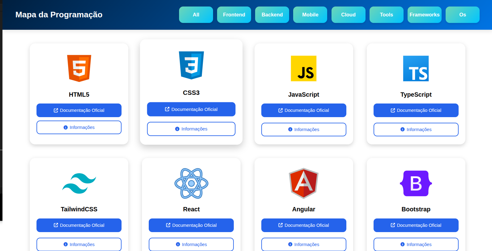
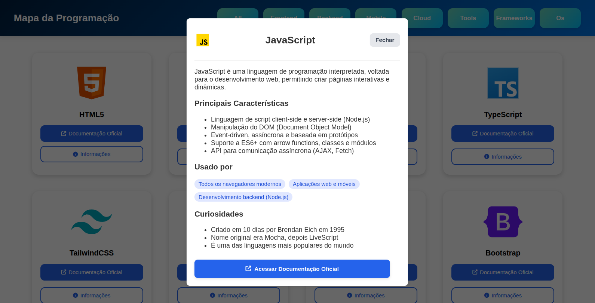

# 🗺️ Mapa da Programação

Um projeto visual e interativo desenvolvido com **HTML**, **CSS** e **JavaScript**, que apresenta uma visão geral das principais tecnologias utilizadas no desenvolvimento web. Ideal para iniciantes que desejam entender diferentes linguagens, bibliotecas e frameworks, ou para profissionais que buscam uma visão organizada das ferramentas disponíveis.

---

## 📌 Funcionalidades

- Interface amigável, moderna e responsiva
- Ícones ilustrativos para cada tecnologia
- Modal com informações detalhadas de cada tecnologia
- Filtro por categoria (Frontend, Backend, Mobile, Cloud, etc.)
- Destaque visual no botão selecionado
- Menu flutuante com ícone dinâmico (menu → fechar)
- Fechamento automático do menu ao clicar em uma categoria (mobile)

---

## 🛠️ Tecnologias Utilizadas

- **HTML5** – Estruturação da interface e conteúdo semântico  
- **CSS3** – Estilização visual moderna e responsiva  
- **JavaScript (Vanilla)** – Interatividade do site sem bibliotecas externas  
- **JSON** – Armazenamento e carregamento dos dados dos modais  
- **DOM API** – Manipulação do DOM com `querySelector`, `classList`, `addEventListener`, etc.  
- **Responsive Design** – Adaptação da interface para diferentes tamanhos de tela  
- **MutationObserver** – Prevenção de rolagem do `body` ao abrir o modal  

---

## 📷 Capturas de Tela

### 🖼️ Página Principal


### 🪟 Modal de Informações


---

## 🚀 Como Executar

1. Clone o repositório:
   ```bash
   git clone https://github.com/seu-usuario/mapa-da-programacao.git
   ```

2. Acesse a pasta do projeto:
   ```bash
   cd mapa-da-programacao
   ```

3. Abra o arquivo `index.html` no navegador.

---

## 🎯 Lógica JavaScript

### 📦 `modal.js` – Controle dos Modais

- Carrega dinamicamente os dados de `modais.json`
- Insere conteúdo no modal com título, ícone, características, usos e curiosidades
- Mostra ou oculta o modal conforme interações do usuário

```js
fetch("modais.json")
  .then(res => res.json())
  .then(data => {
    cardData = data;
    initModals(); // Inicia os eventos do modal
  });
```

---

### 🧭 `home.js` – Filtros e Navegação

#### ✅ Filtragem de Cards por Categoria

```js
const botao = document.querySelectorAll(".botao");

botao.forEach(botao => {
  botao.addEventListener("click", function () {
    const categoria = botao.textContent.toLowerCase();
    const todosCard = document.querySelectorAll(".cards");

    todosCard.forEach(card => {
      if (categoria === "all" || card.classList.contains(categoria)) {
        card.style.display = "block";
      } else {
        card.style.display = "none";
      }
    });
  });
});
```

#### 🎨 Destaque do Botão Selecionado

```js
const botoes = document.querySelectorAll(".botao");

botoes.forEach(botao => {
  botao.addEventListener("click", () => {
    botoes.forEach(b => b.classList.remove("selecionado"));
    botao.classList.add("selecionado");
  });
});
```

#### 📱 Menu Hamburguer (Mobile)

- Abre/fecha menu
- Fecha automaticamente ao clicar fora ou ao redimensionar para desktop

#### 🔒 Fechamento do Modal

- Clique no fundo escuro (`fade`)
- Pressionar tecla `ESC`
- Prevenção de scroll quando o modal está aberto

```js
document.addEventListener("keydown", (event) => {
  if (event.key === "Escape") {
    modal.classList.add("hide");
    fade.classList.add("hide");
  }
});
```

---

## 👨‍💻 Contribuidores 

- [@jeffsHenrique](https://github.com/JeffsHenrique)
